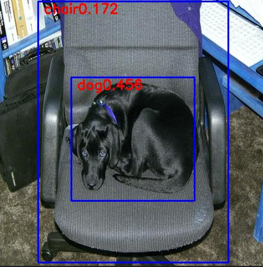
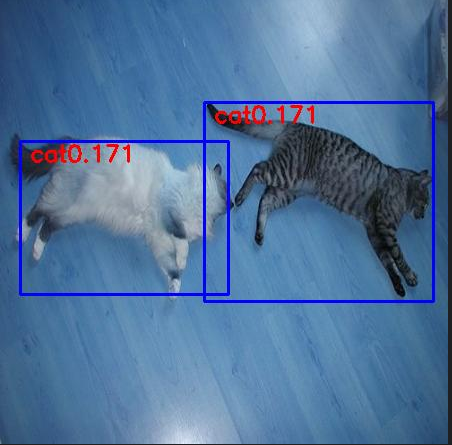
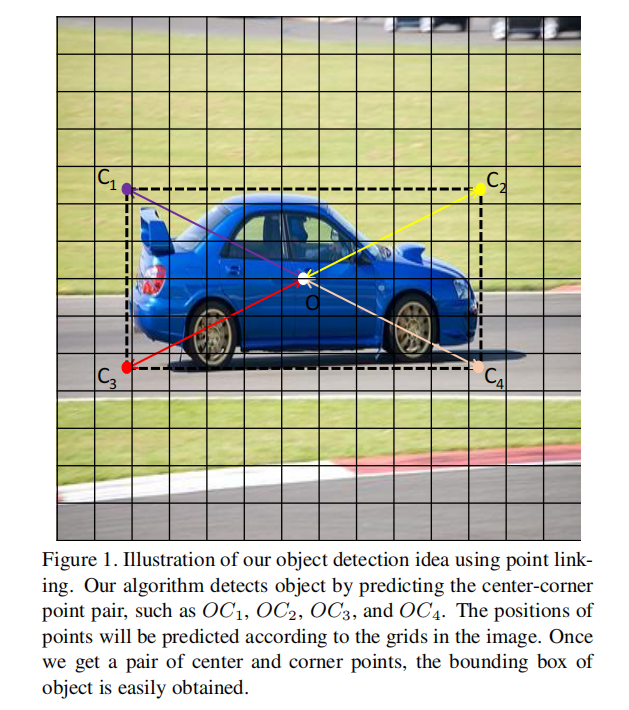

# Point Linking Network

## 用法

```
-plnData.py（数据集预处理和构建）
-plnLoss.py（计算损失函数）
-new_resnet.py（网络构建）
-write_txt.py（对PASCAL VOC7进行预处理）
-train.py（训练函数）
-predict.py（预测函数）
-test.py（测试，可以忽略）
首先运行write_txt.py进行数据预处理
然后可以设置batch_size,num_epochs,运行train.py进行训练
然后可以设置img_root，运行predict.py进行预测，预测的图片存在test_001.jpg
```

## 论文主要内容（实际复现）

类似yolov1，通过回归预测中心点和角点（可以分成四个分支，四对中-角点）来实现预测Bounding Box的目的，创新点在于可以通过四个分支：中-左上角，中-右上角，中-左下角，中-右下角，再进行NMS处理，预测准确性更好，并且对于边界区域更敏感，处理有遮挡的物体效果更好。

**代码在一个yolov1复现的基础上进行修改，实现pln的思想和预测。**
## 训练部分

设置S=14，B=2

每个网格预测2个中心点，2个角点，预测每一个点需要5个参数，pij（1），qij（20），xij（1），yij（1），lxij（14），lyij（s=14），即51，预测四个点需要204维，最后的输出矩阵为14x14x204维，按照pij，xij，yij，lxij(14)，lyij(14)，qij(20)的顺序摆放

最后得到的维度为[14,14,204]

### 构建数据集

使用PASCAL VOC7数据集，包含20个类别，对每张图的标注框，提取出中心点和角点归一化坐标，进一步处理，得到所处网格坐标ij corner_ij，相对网格左上角坐标xy corner_xy。

```
# plnData.py
# 取中心点坐标，cxcy_sample表示相对整张图左上角归一化坐标  cxcy_sample: tensor([0.4030, 0.7714])
cxcy_sample = cxcy[i]
right_top_sample = right_top[i]
ij = (cxcy_sample / cell_size).ceil() - 1
corner_ij = (right_top_sample / cell_size).ceil() - 1
xy = ij * cell_size
corner_xy = corner_ij * cell_size
```

之后，按照pij-0，xij-1，yij-2，lxij-3~16，lyij-17~30，qij-31~50的顺序，将标签放入数据集中，中心点标签值需要放在ij网格预测的中心点中，角点标签值需要放在corner_ij网格预测的角点中

```
# pij示例
target[int(ij[1]), int(ij[0]), 0] = 1
target[int(ij[1]), int(ij[0]), 0 + 51 * 1] = 1
target[int(corner_ij[1]), int(corner_ij[0]), 0 + 51 * 2] = 1
target[int(corner_ij[1]), int(corner_ij[0]), 0 + 51 * 3] = 1
# lxij
target[int(ij[1]), int(ij[0]), 3 + int(corner_ij[0])] = 1
target[int(ij[1]), int(ij[0]), 3 + int(corner_ij[0]) + 51 * 1] = 1
target[int(corner_ij[1]), int(corner_ij[0]), 3 + int(ij[0]) + 51 * 2] = 1
target[int(corner_ij[1]), int(corner_ij[0]), 3 + int(ij[0]) + 51 * 3] = 1
```

### 损失函数

首先将预测值和实际值分成中心点部分和角点部分。

```
# plnLoss.py
target_tensor_center = target_tensor[:, :, :, 0:102]
target_tensor_corner = target_tensor[:,:,:,102:]
pred_tensor_center = pred_tensor[:,:,:,0:102]
pred_tensor_corner = pred_tensor[:,:,:,102:]
```

根据实际值，分成包含点的部分和不包含点的部分，再拆分成多个点的预测，51列的形式。

```
# 判断目标是否在网络内
coo_mask_center = target_tensor_center[:, :, :, 0] > 0
coo_pred_center = pred_tensor_center[coo_mask_center].view(-1, int(102))
point_pred_center = coo_pred_center[:, :].contiguous().view(-1, 51)
```

对于不包含点的部分，直接计算中心点和角点的loss_nooobj=pij**2

（注意：原文中并没有说明loss_nooobj误差是否有权值，根据实际训练情况，如果为1的话会让预测数据的pij大部分为0，预测不出任何结果，因此这里设置权值为0.04）

```
nooobj_loss = F.mse_loss(noo_pred_c_center, noo_target_c_center, size_average=False)  
nooobj_loss += F.mse_loss(noo_pred_c_corner, noo_target_c_corner, size_average=False) 
```

对于包含点的部分，计算概率误差，w_class类别误差，w_coord位置误差，w_link链接误差


```
# 计算xij，yij误差
coo_response_mask_xy[:,1:3] = 1
coo_response_mask_xy_corner[:,1:3] = 1
pred_c = point_pred_center[coo_response_mask_xy]
target_c = point_target_center[coo_response_mask_xy]
wcoord_loss = F.mse_loss(pred_c,target_c,size_average=False)
pred_c = point_pred_corner[coo_response_mask_xy_corner]
target_c = point_target_corner[coo_response_mask_xy_corner]
wcoord_loss += F.mse_loss(pred_c, target_c, size_average=False)
```

最后计算的loss为

```
return p_loss + self.w_coord * wcoord_loss + self.w_class * wclass_loss + self.w_link * wlink_loss + nooobj_loss * 0.04
```

### 训练函数

使用RMSprop优化器，设置动量为0.9，学习率为0.001

```
optimizer = torch.optim.RMSprop(
    net.parameters(),
    # 学习率
    lr=learning_rate,
    # 动量
    momentum=0.9,
    # 正则化
    weight_decay=5e-4
)
```

先进行迭代训练，打印出平均loss，在进行测试，计算平均loss

```

    # 计算损失
    total_loss = 0.
    # 开始迭代训练
    for i, (images, target) in enumerate(train_loader):
        # print("training",images.shape,target.shape)
        images, target = images.cuda(), target.cuda()
        pred = net(images)
        # 创建损失函数
        # pred = pred.permute(0, 2, 3, 1)
        loss = criterion(pred, target)
        total_loss += loss.item()
        # 梯度清零
        optimizer.zero_grad()
        # 反向传播
        loss.backward()
        # 参数优化
        optimizer.step()
        if (i + 1) % 5 == 0:
            print('Epoch [%d/%d], Iter [%d/%d] Loss: %.4f, average_loss: %.4f' % (epoch +1, num_epochs, i + 1, len(train_loader), loss.item(), total_loss / (i + 1)))
    # 开始测试
    validation_loss = 0.0
    net.eval()
    for i, (images, target) in enumerate(test_loader):
        images, target = images.cuda(), target.cuda()
        # 输入图像
        pred = net(images)
        # pred = pred.permute(0, 2, 3, 1)
        # 计算损失
        loss = criterion(pred, target)
        # 累加损失
        validation_loss += loss.item()
        # 计算平均loss
    validation_loss /= len(test_loader)

    best_test_loss = validation_loss
    print('get best test loss %.5f' % best_test_loss)
    # 保存模型参数
    torch.save(net.state_dict(), 'pln.pth')
```


## 预测部分

### Pobj概率计算

每个网格预测2*B个点，前B个点为中心点，后B个点为角点，且1-3，2-4会存在链接关系。

首先对输入图片进行预处理，进行图像增强以及重制成448*448形状。

开始对网格的中心点开始遍历，过滤掉pij<p_confident = 0.05的点，采用启发式算法，右上角点应该在该网格点的右上区域，减少循环次数。

```
# predict.py        
        for p in range(2):
            # ij center || mn corner
            for i in range(14):
                for j in range(14):
                    print("start,",i,j)
                    if result[i, j, 0] < p_confident: continue
                    x_area, y_area = [j, 14], [0, i + 1]
```

然后计算该中心点与右上区域网格内角点的Pobj概率的计算，并过滤掉score < score_confident = 0.007的部分


```
        for p in range(2):
            # ij center || mn corner
            for i in range(14):
                for j in range(14):
                    print("start,",i,j)
                    if result[i, j, 0] < p_confident: continue
                    x_area, y_area = [j, 14], [0, i + 1]
                    for n in range(y_area[0], y_area[1]):
                        for m in range(x_area[0], x_area[1]):
                            for c in range(20):
                                p_ij = result[i, j, 51 * p + 0]
                                p_nm = result[n, m, 51 * (p + 2) + 0]
                                i_, j_, n_, m_ = result[i, j, 2], result[i, j, 1], result[n, m, 2], result[n, m, 1]
                                l_ij_x = result[i, j, 51 * p + 3 + m]
                                l_ij_y = result[i, j, 51 * p + 3 + n]
                                l_nm_x = result[n, m, 51 * (p + 2) + 17 + j]
                                l_nm_y = result[n, m, 51 * (p + 2) + 17 + i]
                                q_cij = result[i, j, 51 * p + 31 + c]
                                q_cnm = result[n, m, 51 * (p + 2) + 31 + c]
                                score = p_ij * p_nm * q_cij * q_cnm * (l_ij_x * l_ij_y + l_nm_x * l_nm_y) / 2
                                # print(p_ij,p_nm,l_ij_x,l_ij_y,l_nm_x,l_nm_y,q_cij,q_cnm)
                                # 设置score阈值
                                if score > score_confident:
                                    print(i, j, n, m)
                                    print("score", score)
                                    r.append([i + i_, j + j_, n + n_, m + m_, c, score])
```

然后重新编码，获得[xmin,ymin,xmax,ymax,score,class]的六维张量，待后续处理。

```
            for l in r:
                # 重新encode 变为xmin,ymin,xmax,ymax,score.class
                bbox = [2*l[1]-l[3],l[2],l[3],2*l[0]-l[2]]
                # print(bbox)
                bbox = [b * 32 for b in bbox]
                bboxes_.append(bbox)
                labels_.append(l[4])
                scores_.append(l[5] * 100)
```


### NMS函数

通过NMS函数，设置nms_confident = 0.6，iou_con = 0.5，当置信度小于阈值时直接丢弃，当两个bbox的iou大于阈值是认为预测的同一物体，取置信度高的（注意：这里我直接将score*10作为置信度值）


## 网络部分

使用预训练好的inceptionresnetv2网络，去掉池化层、softmax层和初始块的辅助分支最后三层，并增加1个1x1卷积层，4个3x3卷积层，Sigmoid层，调整输出张量维度为[14,14,204]

```
# new_resnet.py
self.block8 = Block8(noReLU=True)
self.conv2d_7b_yy = BasicConv2d(2080, 3328, kernel_size=1, stride=1, padding=1)
self.avgpool_1a = nn.AvgPool2d(1, count_include_pad=False)
self.conv1 = BasicConv2d(3328, 1536, kernel_size=1, stride=1)
self.conv2 = BasicConv2d(1536, 1536, kernel_size=3, stride=1, padding=1)
self.conv3 = BasicConv2d(1536, 1536, kernel_size=3, stride=1, padding=1)
self.conv4 = BasicConv2d(1536, 1536, kernel_size=3, stride=1, padding=1)
self.conv5 = BasicConv2d(1536, 204, kernel_size=3, stride=1, padding=1)
```

测试结果

```
img_root = "000012.jpg"
```



```
img_root = "000007.jpg"
```



目前因为训练轮次较低，我这里只能用batch_size=1进行训练，一轮大概半个小时左右，只能识别一些内容简单的图片，且准确率较低，可以看出目前已经可以预测一些右上角点和中心点，如果增加训练轮次的话效果应该会变好。

## 参考代码

https://github.com/chasecjg/yolov1

https://github.com/YangYangGirl/point-linking-network?tab=readme-ov-file


# 论文的重点关注（论文翻译+重点）

Two Stage

在第一阶段，基于深度卷积网络的目标检测器遵循“滑动窗口”策略。他们学习分类器逐个检查候选窗口，并获得非最大抑制后得分最高的候选窗口作为检测结果，如OverFeat [29]、R-CNN [12]、Fast-R-CNN [12]。

在第二阶段，深度探测器可以使用单一的网络直接预测/回归物体边界盒，如深度多盒[8]、YOLO [26]、快速-R-CNN[28]和SSD [25]

我们将目标检测问题分为两个子问题：点检测问题和点链接问题。如图1所示，在我们的系统中有两种点，一个物体边界盒的中心点记为O，一个物体边界盒的一个角点，如CA。



为了检测 点对，有两个任务，第一个任务是定位两个点，称为点检测，第二个任务是将这两个点关联起来，即属于同一对象的点，称为点链接。这是本文一般的目标检测思想，它是一种基于点的目标检测框架。与以往的边界盒回归方法相比，该新框架具有三个优点： 1)在任意尺度和任意高宽比下表示边界盒非常灵活。2)对于每个边界框，至少有四对点，可以通过投票来提高目标检测性能。3)它对遮挡具有自然的鲁棒性，因为它可以使用局部线索来推断物体的位置。

我们使用一个单一的深度网络来实现这个基于点的目标检测框架，称为点连接网络（PLN）。在PLN中，点检测和点连接都是在一个联合损失函数中实现的。

每个网格单元表示一个网格单元，表示输入图像的卷积特征映射。网格单元负责预测内部的中心点，包括置信度、x偏移、y偏移和链接，内部的角点也包括置信度、x偏移、y偏移和链接。详情将在第3节中介绍。

### 论文具体设计(读)

在PLN中，我们选择初始v2网络作为基础网络，在特征提取层没有任何特殊设计。

该检测网络基于初始空间v2。我们使用初始空间-v2和一些额外的卷积层来回归点的参数，然后解析参数，得到对象的边界框和类别标签。最后，我们将四个分支（左上、右上、左机器人、右机器人）的盒子合并，应用NMS得到最终的目标检测结果。


在单次拍摄目标探测器[25,27]的设置之后，我们将输入图像I的大小调整为具有相同高度和宽度的固定大小。1 PLN的基础网络是初始空间-v2，根据谷歌[17]提出的调查论文，这是一个快速、准确的目标检测网络。使用初始空间-v2生成的I的卷积特征图，记为F，具有S×S的空间维度。然后，我们将I划分为S×S网格单元，如图1所示。因此，I中的一个网格单元与F中的一个网格单元相关联。对于i∈[1，···，S2 ]，Ii表示图像中的第i个网格单元，Fi表示F中的第i个网格单元。

在PLN中，每个Fi负责2个×B点预测，由B中心预测和B角预测组成。如果我们想预测一个网格单元中的多个对象中心/角，我们设置B > 1。在不丧失普遍性的情况下，我们假设这个拐角是一个右上角。1-B预测是中心点，而（B+1）-（2B）的预测是角点。每个预测包含四个项目： Pij、Qij、[xij、yij ]、L x ij、Ly ij，，其中i∈[1，···，S2 ]为空间索引，j∈[1，···，2×B]为点索引。

### 参数含义

- Pij是网格单元中一个点存在的概率；它有两种形式，P (O)ij和P (C)ij分别表示中心点和角点的存在。用来定位点
- Qij是对象类上的概率分布；假设有N个类；Q (n)ij，n个∈[1，···，N]，是该点属于第n个类的概率。用来分类，得分函数

- [xij，yij ]表示点的准确位置，它相对于I中的单元网格的右上角，并通过网格单元的大小进行归一化。因此，xij和yij都在[0,1]的范围内。
- L x ij，Ly ij表示该点的链接。有一个特殊的设计。L x ij和L y ij都是S长度的向量。第k元素L (k) x ij和L (k) y ij，k∈[1，S]，分别是第k行和第k列网格单元的点的概率。概率被归一化，以确保Σ S k=0L (k) x ij = 1和Σ S k=0L (k) y ij = 1。因此，[L x ij，Ly ij ]表示用（i，j）索引的点与具有arg maxk L (k) x ij和arg maxk L y ij的列索引的网格单元相连。除了空间指数外，如果该点是一个中心点，j∈[1，B]，它用点指数（j+B）连接到角点；如果该点是一个角点，j∈[B + 1,2B]，它用点指数（j−B）连接到中心点。为简单起见，我们使用π（L x ij，Ly ij）来表示同时包含空间索引和点索引的链接索引。

### 损失函数

一个网格单元格是否包含一种点的类型，它们使用✶pt ij和✶nopt ij来表示。里面的点是一个中心点或一个角点并不重要。如果用i和j索引的单元格网格包含该点，则✶选择ij = 1和✶选择ij = 0；否则，✶选择ij = 0和✶选择ij = 1。


然后，如果网格单元包含一个点，则网格单元需要预测其存在性、类分布概率、精确位置和链接点。


基本上，我们最小化点的存在性、分类分数、x偏移、y偏移和连接点的粗糙位置的最小二乘误差

wclass、wcoord和wlink分别是点存在性、精确位置和粗糙位置的权重参数。

同时，给出了一个内部无点的网格的损失函数如下


它是对所有网格单元格和所有类型的点的总和。请注意，在建议的损失中，我们只是简单地使用**欧几里得损失**来回归预测。根据我们的经验，我们发现PLN中的欧几里得损失是稳健的，没有必要为不同类型的预测设计不同的损失函数。

### 推理

对于用（i、j）和（s，t）进行索引的一对点，点对成为第n类的对象的概率由


其中，我们将空间索引（i、s）分别分解为它的x分量和y分量。ix、iy、sx和sy都在[1、S]的范围内。回想一下，我们有一个硬约束，即一个链路只能存在于一对中心点和角点之间，记为|j−t| = B)。因此，L（sx）x ijL（sy）y ij表示与（s、t）相连的概率点（i、j），L（ix）x stL（iy）y st表示与（i、j）相连的概率点（s、t）。

### 实验

pln主要基于在张量流2中提供的IrmageNet图像分类数据集上预训练的Inception-v2。使用**RMSProp优化器**对张量流的初始-v2模型进行训练，因此我们也使用该优化器训练pln。

### 重点

- 图1中有四个角点，分别是左上角、右上角、左下角和右下角。很明显，任何一对中心点和角点都可以确定一个边界框。为了检测点对，有两个任务，第一个任务是定位两个被称为点检测的点，第二个任务是将这两个点关联起来，即属于同一对象的点，称为点链接。

- 14x14x204维如何得到：s=14，预测四个点b1,b2,b3,b4，其中b1,b2为中心点，b3,b4为角点（以右上角为例），同时b1和b3连接，b2和b4连接，即对于b1来说argmax(Lxij)=b3.x，y同理，

